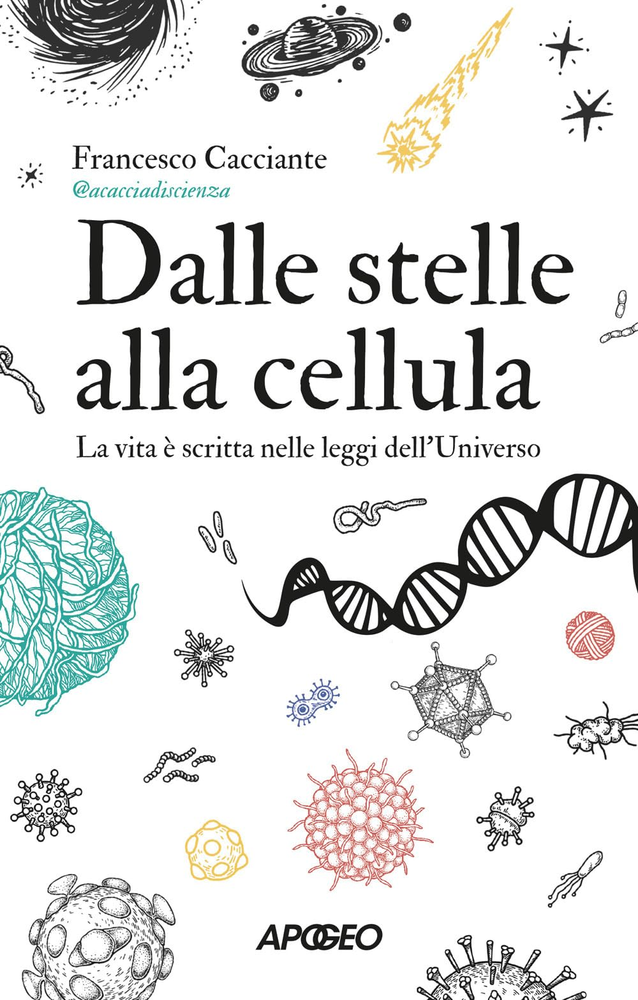

## Acknowledgments

This work was inspired by the book **"Dalle Stelle alla cellula"** by [Francesco Cacciante](https://x.com/cacciadiscienza). The core concept of AchemDB draws from his beautiful explanation about proto-metabolism and what could have happened inside a "crateric lake" in primordial planet Earth - where simple molecules interacted through reactions, gradually evolving into more complex structures. This biological and chemical inspiration provided the foundation for thinking about data processing as a reactive, evolving system rather than static storage and retrieval.
