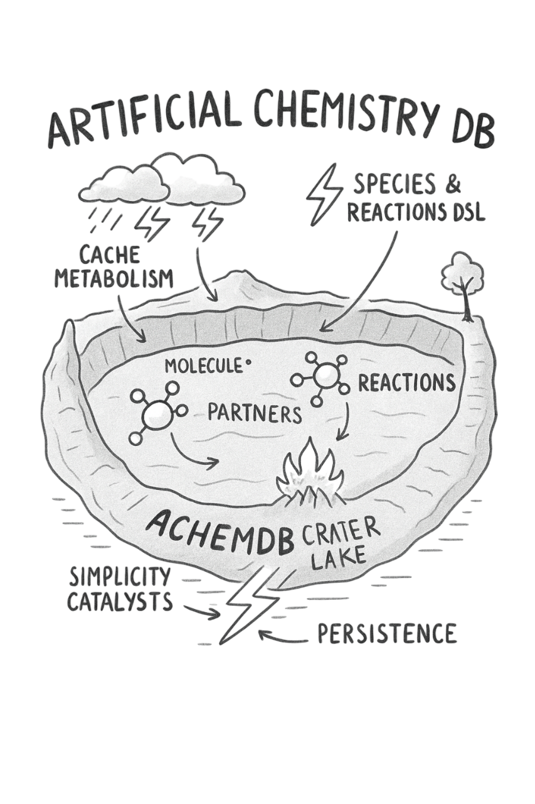

# Core Concepts

This document describes the core concepts of AChemDB in more detail than the README.

---

## Molecules

A **molecule** is the fundamental data unit in AChemDB. It represents a piece of information that can participate in reactions.

Fields (simplified):

- `ID` – unique identifier (`MoleculeID`)
- `Species` – logical type of the molecule (`SpeciesName`)
- `Payload` – arbitrary `map[string]any` with domain-specific data
- `Energy` – floating-point value that can increase/decrease over time
- `Stability` – additional numeric property that reactions can use
- `Tags` – optional list of strings for categorisation
- `CreatedAt` – environment time when the molecule was created
- `LastTouchedAt` – environment time when the molecule was last updated

Molecules are created by:

- your application (inserting events),
- reactions (via `create` effects).

They are consumed or updated by reactions.

---

## Species

A **species** defines a family of molecules with a common role.

Examples:

- `Event` – raw events from your system (logs, metrics, user actions).
- `Suspicion` – markers for suspicious IPs or users.
- `Alert` – security alerts you want to send downstream.

In the schema, species are defined with:

- `Name` (string),
- optional `Description`,
- optional `Meta` (arbitrary metadata for tooling / documentation).

Species do not enforce a rigid schema on the `Payload` (this is intentionally flexible), but they give structure to your domain and help reactions select molecules.

---

## Schema

A **schema** is the combination of:

- a set of `Species`,
- a set of `Reactions`.

In Go, you build a schema with:

- `NewSchema("name")`,
- `.WithSpecies(...)`,
- `.WithReactions(...)`.

From the DSL side, the same information is represented by a `SchemaConfig` JSON document:

- `name`
- `species[]`
- `reactions[]`

A schema is associated with an environment and is assumed to be **stable** while the environment runs. (You can replace/update the schema via HTTP if needed.)

---

## Reactions

A **reaction** describes how molecules transform.

In Go, a reaction implements the `Reaction` interface:

- `ID() string` – stable identifier.
- `Name() string` – human-friendly name.
- `InputPattern(m Molecule) bool` – whether this reaction is interested in this molecule.
- `Rate() float64` – base probability (0–1).
- `EffectiveRate(m Molecule, env EnvView) float64` – base rate adjusted by catalysts or other context.
- `Apply(m Molecule, env EnvView, ctx ReactionContext) ReactionEffect` – transformation logic.

The result of `Apply` is a `ReactionEffect`:

- `ConsumedIDs []MoleculeID` – molecules to remove.
- `Changes []MoleculeChange` – molecules to update.
- `NewMolecules []Molecule` – molecules to insert.
- `AdditionalOps []Operation` – placeholder for future operations (logging, metrics, etc.).

### Config-based reactions

Most users won’t implement `Reaction` by hand, but will use config-based reactions loaded from JSON via `SchemaConfig` / `ReactionConfig`.

These reactions support:

- input conditions (`input.species`, `input.where`, `input.partners`),
- probabilistic rate (`rate`) and catalysts (`catalysts[]`),
- rich effects:
  - `consume`,
  - `update` (e.g. `energy_add`),
  - `create`,
  - conditional `if/then/else`,
  - `count_molecules` aggregations.

See `docs/dsl.md` for full details (TBD).

---

## Catalysts

A **catalyst** is a molecule that increases the probability of a reaction without being consumed by it.

In the DSL (`ReactionConfig.catalysts[]`), a catalyst definition typically includes:

- `species` – which molecules can act as catalysts,
- optional `where` – constraints on payload values,
- `rate_boost` – how much to increase the base rate,
- `max_rate` – upper bound on the effective rate.

During `EffectiveRate`:

- the reaction looks for matching catalyst molecules in the environment,
- if found, the base rate is increased by `rate_boost`,
- `max_rate` ensures the effective rate does not exceed a limit.

This allows patterns like:

- “If this kind of ‘context’ molecule exists, reactions become more likely.”
- e.g. “If this IP is already under suspicion, new failures trigger reactions more easily.”

---

## Environment and ticks

An **environment** is a container for:

- a schema,
- a population of molecules,
- an internal clock (`EnvTime`).

It is the unit that actually _runs_ the simulation.

Key points:

- Environments are **isolated**: molecules only interact within the same environment.
- Time advances in **discrete steps** called **ticks** (`Step()` calls).
- At each tick:
  1. The environment time is incremented.
  2. A snapshot of all molecules is taken.
  3. For each molecule in the snapshot, each reaction:
     - checks `InputPattern`,
     - computes `EffectiveRate`,
     - may fire (`Random() <= effectiveRate`),
     - produces a `ReactionEffect`.
  4. All effects are applied in batch:
     - consumed molecules removed,
     - updates applied (last-wins semantics),
     - new molecules inserted.

The snapshot semantics guarantee that all reactions within a tick “see” the same starting state.

Environments can be:

- **stepped manually** by calling `Step()` from Go or via the HTTP `/tick` endpoint,
- **run automatically** with an internal ticker via `/start?interval=...`.

---

## Multiple environments

A single AChemDB server can host **multiple environments**.

The `EnvironmentManager` manages them by:

- creating environments with a given ID and schema,
- returning handles to environments by ID,
- listing and deleting environments.

Each environment:

- has its own schema,
- its own molecules,
- its own time and tick scheduling,
- is independent from others.

This is useful to separate:

- `production` vs `staging`,
- different tenants,
- different use cases.

---

## Notifications

AChemDB has a **notification system** that allows you to be informed when reactions fire.

Conceptually:

- Each `ReactionConfig` may include a `notify` section:
  - `enabled: true/false`,
  - `notifiers: ["webhook-1", "websocket-1", ...]`.
- When that reaction produces an effect (consume/update/create), AChemDB:
  - builds a `NotificationEvent` containing:
    - environment ID,
    - reaction ID/name,
    - `input_molecule`,
    - partners (if any),
    - consumed/created/updated molecules,
    - the raw `ReactionEffect`,
    - timestamps.
  - enqueues the event in the `NotificationManager`.
- The `NotificationManager`:
  - dispatches the event to the selected notifiers asynchronously,
  - uses retry + backoff for transient failures (e.g. webhook temporarily down).

Currently implemented notifiers include:

- **Webhook** – POST JSON to a configured URL.
- **WebSocket** – push events over WebSocket connections.

More notifiers (RabbitMQ, Kafka, etc.) can be added without changing the core engine.

See `docs/notifications.md` (TBD) for detailed configuration and event format.

---

## Client package

The `pkg/client` package provides a fluent Go API to build schemas and send them to an AChemDB server.

It sits conceptually on top of the DSL:

- `client.NewSchema(...).Species(...).Reaction(...)`
- builder methods for:
  - inputs, where-conditions, effects,
  - `if/then/else`, `count_molecules`, partners, catalysts, notifications.
- `client.ApplySchema(ctx, baseURL, envID, schema)` turns the fluent definition into JSON and POSTs it to the HTTP server.

This lets you:

- keep schemas in code with type safety, autocomplete, and refactoring support,
- still use the same JSON DSL under the hood.

For more details, see the examples in the README and planned `docs/dsl.md`.
